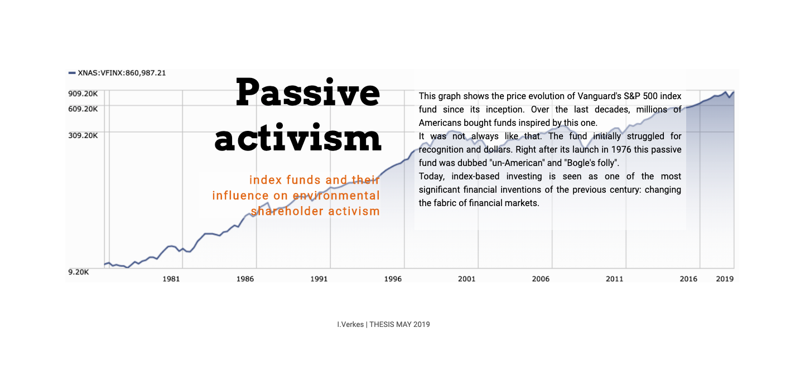
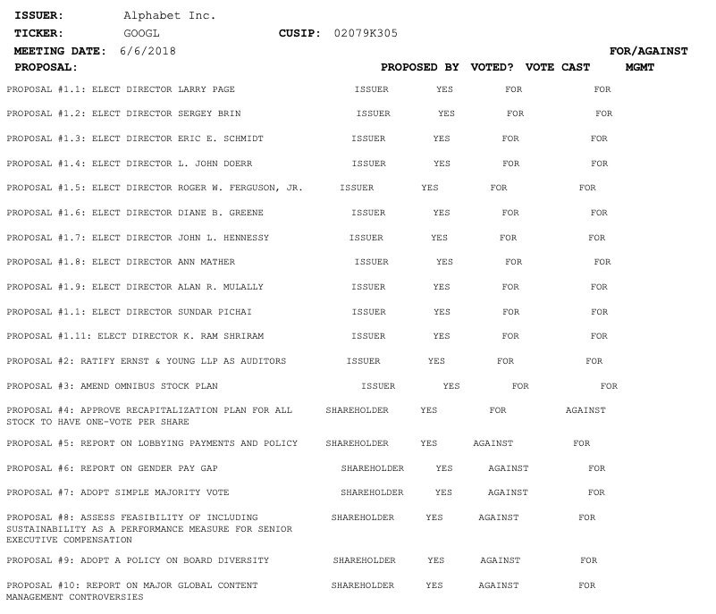

### Passive Activism 

#### Environmental shareholder activism and the role of index funds
The increase in passively invested money, index funds, is affecting the relationship between management and shareholders in basically every listed U.S. company. As index funds account for a larger share of the stock market, more voting power lies with the largest fund managers. As activists have been submitting more shareholder proposals on environmental issues, how did this voting power of index funds play out? 
  
This article is a first look at this question using public voting records of the three largest index fund providers ([Form N-PX](https://www.sec.gov/reportspubs/investor-publications/investorpubsmfproxyvotinghtm.html) filings).  
   

[Project link](https://isver.github.io/ms-t/)

#### Data source and methodology
Mutual funds and other registered management investment companies vote on behalf of the investors in their funds. In doing so, they have a [fiduciary duty](https://www.sec.gov/rules/final/ia-2106.htm) that prescribes that asset managers act in the sole interest of their clients (the beneficial owners of the securities), disregarding their own self-interest. How to interpret this "sole interest of the owners"?  
As index-based investment providers grew in size, this question became more prominent. Millions of people own mutual funds and exchange traded funds (ETFs), and this number is growing. How do asset managers represent us at shareholder meetings? As fiduciaries, how do they interpret our interests?
   
These asset managers need to disclose how they voted on their securities with the Securities and Exchange Commission (SEC). The SEC has a [search function](https://www.sec.gov/edgar/searchedgar/mutualsearch.html) allowing investors to look at voting records for each mutual fund and other investment companies. The interesting filing here is Form N-PX. See [an example of a Form N-PX]( https://www.sec.gov/Archives/edgar/data/36405/000093247118006954/indexfunds0835.html) for Vanguard's index funds.
These text files is the data used for the visual article. Data scraping, cleaning and analysis was done with regex and pandas in python. Each vote is represented in a standardized format, like the example for Alphabet below.   

#### Read more

##### On the issue:
- John Bogle, 'Bogle Sounds a Warning on Index Funds', *WSJ* (November 2018) - [article link](https://www.wsj.com/articles/bogle-sounds-a-warning-on-index-funds-1543504551)
- Leslie P. Norton, 'Corporate America Had Better Take Note. Fund Managers Are the New Activist Investors', Barron's (April 2019) - [article link](https://www.barrons.com/articles/mutual-fund-managers-activist-investors-51554498763)
- Adriana Robertson, 'Passive in Name Only: Delegated Management and 'Index' Investing', *Yale Journal on Regulation* (May 2019) - [article link](https://papers.ssrn.com/sol3/papers.cfm?abstract_id=3244991)
##### More in depth:
- Lucian A. Bebchuk and Scott Hirst, 'Index Funds and the Future of Corporate Governance: Theory, Evidence, and Policy', *Columbia Law Review* (May 2019) - [article link](https://poseidon01.ssrn.com/delivery.php?ID=673064096005021118019023097104029100001024071012061053073118018088121007070115101091011099101107042108110073124023066099082098031034078007004004111007022111122038047037013019116005111097006119102068101004026123082013008103065100107099076097115004&EXT=pdf)
- Bernard S. Sharfman, 'Proposed New Disclosures for Mutual Fund Advisers', *CLS Blue Sky Blog*, (October 2018) - [article link](http://clsbluesky.law.columbia.edu/2018/10/19/proposed-new-disclosures-for-mutual-fund-advisers/)
